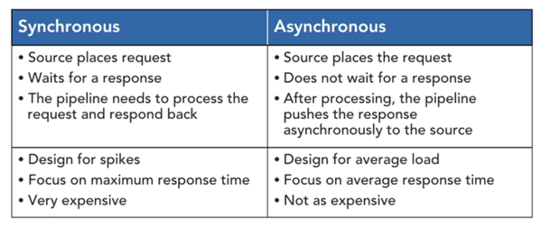
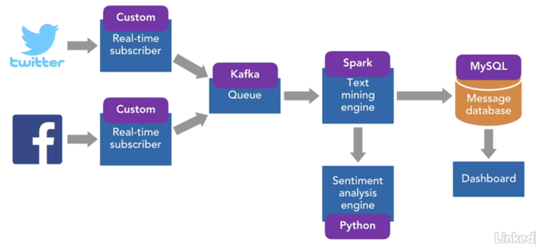
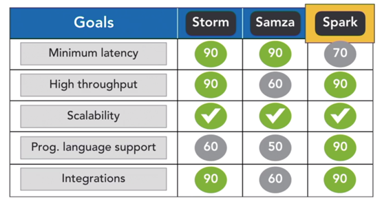
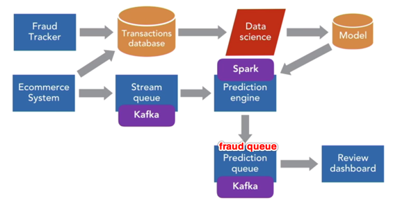
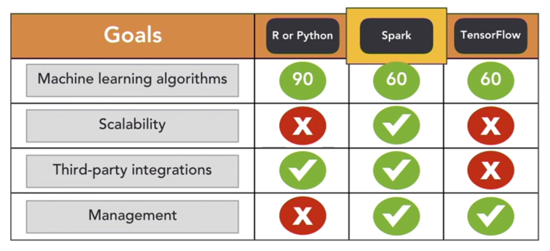
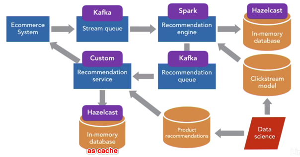

# Architecting Big Data Applications Note

## Real-Time Applications

Real-Time

- As the response time expectations get higher, or the target response times get lower, the cost increases exponentially.
- Go as high as possible for the response time value without impacting user experience or application effectiveness.

Synchronous vs. Asynchronous Pipelines

Strategies

- Use asynchronous pipelines wherever possible.
- **DO NOT** use synchronous pipelines unless absolutely required.
- Build horizontally scalable systems that maximize **parallel processing**.
- Use **buffering queues** between producers and consumers to adjust for differences in throughput.
- Service components in the architecture should be **stateless**.
- If state needs to be stored, use database, in memory data grids or clusters.
- Every request in a real-time pipeline has a time to live, after which, it goes stale or out of context. Monitor it and drop the request if it exceeds.

---

### Social Media Sentiment Analysis

#### Problem

Business needs an overall real-time (a few minutes) tracking board and list of negative posts and posters.

Goals:

- real-time monitoring: a few minutes
- horizontal scalability for future growth in posts and additional analytics
- real-time summary for the overall social media sentiment
- capability to add more social media channels

#### Solution

- You can create separate subscription threads for each of the hashtags.
- Use one single Kafka topic.
- The number of Spark and Kafka partitions should be the same.
- Each post can be processed independently.
- Use map operations to cleanse text.
- Use sentiment analysis engine.
- Use reduce to summarize tweets by sentiment.
- Keep batch intervals as high as possible.

#### Technologies

##### Stream Processing

##### Streaming Message Queues

- :negative_squared_cross_mark: RabbitMQ

- :negative_squared_cross_mark: Apache ActiveMQ

- :white_check_mark: Apache Kafka (choose this one because of excellent integration with Apache Spark)

The above three have equivalent capabilities.

##### Real-Time Subscribers

- Build customized subscribers to subscribe to messages in real time, and then push them to Kafka.

##### Sentiment Analysis Engine

- Build a web service (application) based on Python libraries (NTLK package).
- Scale by using multiple web servers behind a load balancer.

##### Message Database

- MySQL can easily handle 100,000 records per day.
- If the number of records increases in the future, you may need to use NoSQL.  

---

### Payment Fraud Detection

#### Problem

When a customer buys online, your business wants to determine fraud before order shipment.

Goals:

- real-time: within minutes
- asynchronous
- predictive analysis
- enable human review of fraudulent transactions

#### Solution

- In order to have minimum or no backlog at all times, you can create enough partitions on Kafka and Spark to de-queue at the speed messages are queued.
- Load the data science model in each of the partitions in Spark.
- Keep the prediction model loaded and stored in Spark broadcast variables, which will automatically distribute the model to all the partitions and will avoid frequent network traffic.
- Predict in map operations as each transaction is independent.
- The number of Spark and Kafka partitions should be the same.

#### Technologies

##### Machine Learning

##### Streaming Message Queues

- Apache Kafka

---

### E-Commerce Product Recommendations

#### Problem

Your business wants to recommend products in real time (a few seconds) while the user is browsing your e-commerce website.

- Recommendation based on the product currently being viewed.
- Recommendation based on the clickstream during the current browsing session.

#### Solution

- Combine two kinds of recommendations to give a consolidated list of products.
- Each event is handled and predicted and the in-memory database is accessed inside the map function to ensure parallelism.
- Adopt asynchronous recommendation.
- Purge old data once session expires.

#### Technologies

##### Recommendation Service

- Should be stateless.
- Any state should be stored in the central in-memory database.
- Deploy multiple recommendation services behind a load balancer.

##### In-Memory Database

- Use in-memory database to store current user, session and recommendations.

---

### Mobile Couponing

#### Problem

#### Solution

#### Technologies
