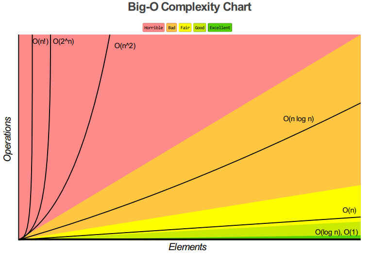
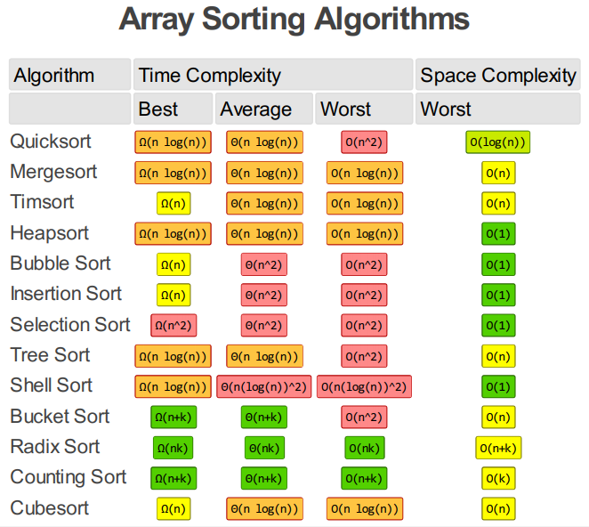

# Data Structures and Algorithms Note 

## Data Structures 

### Linked List

Types of linked list: 

- Simple Linked List 
- Doubly Linked List 
- Circular Linked List

When to Use a Linked List:

- You do not need random access to any specific elements.
- You need to do constant insertions and deletions.
- You are not sure how many items will be in the list.

#### Simple Linked List


- Advantages: insertion and deletion can be very quick.
  - insertion (prepend) - **O(1)**
  - insertion (append) - **O(n)**
- Disadvantages 
  - Slow to access an element. **O(n)**
  - Memory is a concern. Require data and pointers. 

#### Doubly Linked List 


#### Circular Linked List

##### Singly Circular Linked List


##### Doubly Circular Linked List


---

### Stack 

flexible size


Operations:

- push(): 
  - Firstly check if the stack is full. 
- pop(): 
  - Firstly check if the stack is empty. 
  - Return the top value. 
- peek(): get the top data element of the stack, without removing it.
  - `return stack[top]`
- isFull(): check if stack is full.
  - ```
    // array implementation 
    if (top == MAXSIZE - 1)
        return true;
    else
        return false;
    ```
- isEmpty(): check if stack is empty.
  - ```
    // array implementation 
    if (top == -1)
        return true;
    else
        return false;
    ```
    
---

### Queue

flexible size


Operations:

- enqueue():
  - Firstly check if the queue is full. 

- dequeue():
  - Firstly check if the queue is empty. 
  - Return the front value. 

- peek(): get the element at the front of the queue without removing it. 
  - `return queue[front]`

- isFull(): check if queue is full.
  - ```
    // array implementation 
    if (rear == MAXSIZE - 1)
        return true;
    else
        return false;
    ```

- isEmpty(): check if queue is empty.
  - ```
    // array implementation
    if (front < 0 || front > rear) 
      return true;
    else
      return false;
    ```


## Algorithms 

### Basic Concepts 

#### Algorithm Complexity 

Two main factors decide the efficiency of algorithm: 
- Time Factor: counting the number of key operations. 
- Space Factor: counting the maximum memory space required by the algorithm. 

#### Asymptotic Analysis 

Refers to computing the running time of any operation in mathematical units of computation. 

The time required by an algorithm falls under three types:

- Best Case - minimum time required for program execution.
- Average Case - average time required for program execution.
- Worst Case - maximum time required for program execution.

Asymptotic Notations:

- Omega Notation **Ω(n)** - measures the **best case** time complexity or the best amount of time. 
- Big O Notation **Ο(n)** - measures the **worst case** time complexity or the longest amount of time. 
- Theta Notation **θ(n)** - express both the lower bound and the upper bound of an algorithm's running time. 

#### Big O Complexity Chart



#### Sorting Algorithms Complexity Table



#### Big O Cheat Sheet


#### Greedy Algorithms

localized optimum solution

Most networking algorithms use the greedy approach:

- Travelling Salesman Problem
- Prim's Minimal Spanning Tree Algorithm
- Kruskal's Minimal Spanning Tree Algorithm
- Dijkstra's Minimal Spanning Tree Algorithm
- Graph - Map Coloring
- Graph - Vertex Cover
- Knapsack Problem
- Job Scheduling Problem

#### Divide and Conquer

The algorithms based on divide-and-conquer programming approach:

- Merge Sort
- Quick Sort
- Binary Search
- Strassen's Matrix Multiplication
- Closest pair (points)

#### Dynamic Programming

overall optimization

For problems which can be divided into **similar** sub-problems, so that their results can be re-used.

Use the output of a smaller sub-problem and then try to optimize a bigger sub-problem. 

Use Memorization to remember the output of already solved sub-problems.

Problems solved using dynamic programming approach:

- Fibonacci number series
- Knapsack problem
- Tower of Hanoi
- All pair shortest path by Floyd-Warshall
- Shortest path by Dijkstra
- Project scheduling

---

### Searching Algorithms 

- Linear Search - work better finding all matched values in an array. 
- Binary Search - work better finding one match if there is no duplicates in the array. The array must be sorted in advance. 

