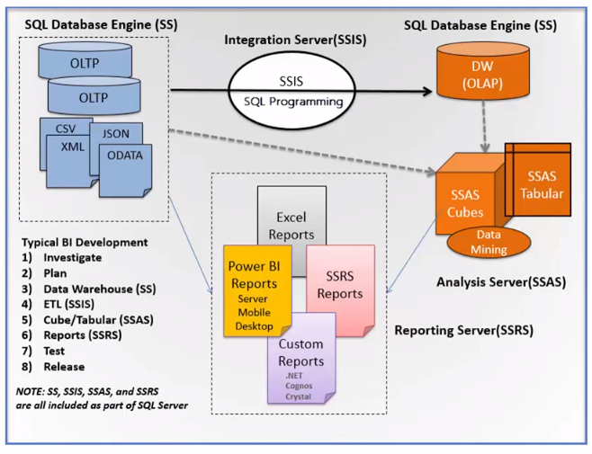
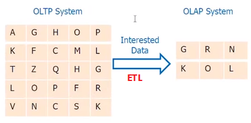
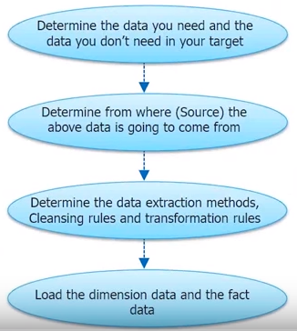

# ETL Note 

## ETL Processing

### ETL Overview 









**ETL Challenges** 

- incremental load
- data duplication 
- takes hours for load to complete 

**Data Extraction** 

- ETL jobs are scheduled during off peak hours. 
- ETL process can be made file dependent or time dependent. 
- Two ways of reading data from source systems: 
    - Read everything for every run.
    - Read only the incremental changes. (more efficient)

*Create a separate table where we store the status of all the run in order to avoid data loss due to run failure.* 


---

**Transforming data from tables**


Newer databases use nVarchar instead of varchar. 

Making data types and character lengths more consistent can assist other developers using this code.

```sql
SELECT 
  [TitleId] = [title_id] 
, [TitleName] = CAST([title] as nVarchar(100)) 
, [TitleType] = CASE CAST([type] as nVarchar(100)) 
   When 'business' Then 'Business'
   When 'mod_cook' Then 'Modern Cooking'                             
   When 'popular_comp' Then 'Popular Computing'                     
   When 'psychology' Then 'Psychology'                         
   When 'trad_cook' Then 'Traditional Cooking'    
   When 'UNDECIDED' Then 'Undecided'                                 
  End
FROM [pubs].[dbo].[titles];
```

---

**Loading transformed data into a new data structure**

```sql
Use TempDB;
Go
-- Create a reporting table 
CREATE TABLE [dbo].[DimTitles]
( [TitleId] [char](6) NOT NULL
, [TitleName] [nVarchar](100) NOT NULL
, [TitleType] [nVarchar](100) NOT NULL
);
Go
-- Add transformed data
INSERT INTO [TempDB].[dbo].[DimTitles]
 SELECT 
   [TitleId] = [title_id] 
 , [TitleName] = CAST([title] as nVarchar(100)) 
 , [TitleType] = CASE CAST([type] as nVarchar(100)) 
    When 'business' Then 'Business'
    When 'mod_cook' Then 'Modern Cooking'                             
    When 'popular_comp' Then 'Popular Computing'                     
    When 'psychology' Then 'Psychology'                         
    When 'trad_cook' Then 'Traditional Cooking'    
    When 'UNDECIDED' Then 'Undecided'                                 
   End
 FROM [pubs].[dbo].[titles];
Go
```

---

To complete the ETL process you create and test ETL queries for each reporting table. These reporting tables are then collected into reporting databases called data warehouses or data marts.

