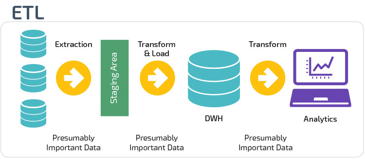
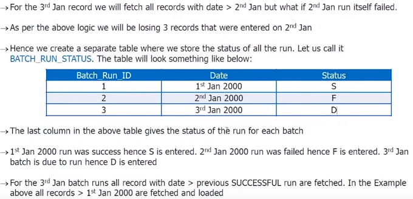
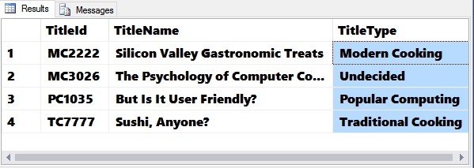
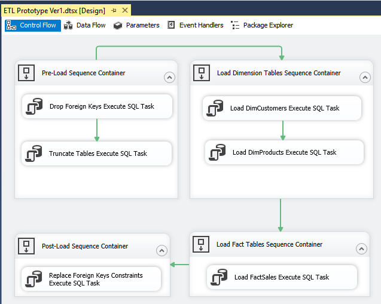
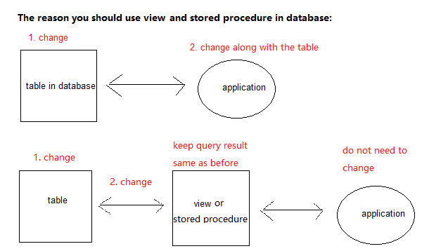

# ETL Note 

[TOC]

Tutorial: [Microsoft: DAT217xImplementing ETL with SQL Server Integration Services](https://courses.edx.org/courses/course-v1:Microsoft+DAT217x+2T2018/course/)

Download [code](https://github.com/MicrosoftLearning/Implementing-ETL).

original source database (AdventureWorksLT2012) -> reporting database (DWAdventureWorksLT2012 )

---

## ETL Processing

### ETL Overview 





**ETL Challenges** 

- incremental load
- data duplication 
- takes hours for load to complete 

**Data Extraction** 

- ETL jobs are scheduled during off peak hours. 
- ETL process can be made file dependent or time dependent. 
- Two ways of reading data from source systems: 
    - Read everything for every run.
    - Read only the incremental changes. (more efficient)

*Create a separate table where we store the status of all the run in order to avoid data loss due to run failure.* 



**Transforming data from tables**



```sql
-- Converting Data Using Cast
SELECT 
  [TitleId] = [title_id] 
, [TitleName] = CAST([title] as nVarchar(100)) 
, [TitleType] = CASE CAST([type] as nVarchar(100)) 
   When 'business' Then 'Business'
   When 'mod_cook' Then 'Modern Cooking'                             
   When 'popular_comp' Then 'Popular Computing'                     
   When 'psychology' Then 'Psychology'                         
   When 'trad_cook' Then 'Traditional Cooking'    
   When 'UNDECIDED' Then 'Undecided'                                 
  End
FROM [pubs].[dbo].[titles];
```

**Loading transformed data into a new data structure**

```sql
Use TempDB;
Go
-- Create a reporting table 
CREATE TABLE [dbo].[DimTitles]
( [TitleId] [char](6) NOT NULL
, [TitleName] [nVarchar](100) NOT NULL
, [TitleType] [nVarchar](100) NOT NULL
);
Go
-- Add transformed data
INSERT INTO [TempDB].[dbo].[DimTitles]
 SELECT 
   [TitleId] = [title_id] 
 , [TitleName] = CAST([title] as nVarchar(100)) 
 , [TitleType] = CASE CAST([type] as nVarchar(100)) 
    When 'business' Then 'Business'
    When 'mod_cook' Then 'Modern Cooking'                             
    When 'popular_comp' Then 'Popular Computing'                     
    When 'psychology' Then 'Psychology'                         
    When 'trad_cook' Then 'Traditional Cooking'    
    When 'UNDECIDED' Then 'Undecided'                                 
   End
 FROM [pubs].[dbo].[titles];
Go
```

To complete the ETL process you create and test ETL queries for each reporting table. These reporting tables are then collected into reporting databases called data warehouses or data marts.

It is a **best practice** for professionals to **use views**, **stored procedures**, and **functions** in their ETL solutions. 

---

### Steps of Creating ETL Processing Using SSMS (code level)

1. Create views from the source tables. 
2. Create the procedure from views. Begin.
3. Declare variables, including return code, event name, event status, and event error info. 
4. Try-catch block. 
   1. Begin transaction. 
   2. ETL code.
   3. Commit transaction.
   4. Set event status, event error info, and return code.
   5. In Catch, roll back transaction, set event status, event error info, and return code. 
5. Log, including event name, event status, and event error info. 
6. Return return code.
7. End the procedure. 

```sql
CREATE -- Fill Dim Customers Procedure
PROCEDURE pETLFillDimCustomers
AS
	/**************************************************************
	Desc: Fills the DimCustomers dimension table
	ChangeLog: When, How, What
	20160101,RRoot,Created Procedure  
	**************************************************************/
Begin -- Procedure Code
	Declare 
	  @RC int = 0
	, @EventName nvarchar(200) = 'Exec pETLFillDimCustomers'
	, @EventStatus  nvarchar(50) = ''
	, @EventErrorInfo  nvarchar(1000) = ''
	;
 Begin Try 
  Begin Transaction; 
  -- ETL Code  -------------------------------------------------------------------

	INSERT INTO [DWAdventureWorksLT2012].[dbo].[DimCustomers]
	SELECT 
	  [CustomerID]
	, [CompanyName]
	, [ContactFullName]
	FROM [DWAdventureWorksLT2012].[dbo].[vETLDimCustomersData];
	  
  -- ETL Code  -------------------------------------------------------------------
  Commit Transaction;
  Select @EventStatus = 'Success', @EventErrorInfo = 'NA';
  Set @RC = 100; -- Success
 End Try
 Begin Catch
  Rollback Tran;
  Select @EventStatus = 'Failure';
  -- select and format information about any error (JSON)-- 
  Execute pSelErrorInfo @ErrorInfo = @EventErrorInfo output;
  ---------------------------------------------------------------------------------------------
  Set @RC = -100; -- Failure
 End Catch
   -- Logging Code  -------------------------------------------------------------------
	  Execute pInsETLEvents
			@ETLEventName =  @EventName
		  , @ETLEventStatus = @EventStatus
		  , @ETLEventErrorInfo = @EventErrorInfo
		  ;  
  -- Logging Code  -------------------------------------------------------------------
  -- Now insert it into the ETLEvents table  
 Return @RC;
End -- Procedure Code
;
go
```

---

## ETL With SQL Programming 

### Two Ways to Perform ETL Process

- Flush and Fill
- Incremental loading process (using views, stored procedures, and UDFs/user defined functions)
  - SQL Merge - most efficient method 

```sql
Merge Into DimCustomers as TargetTable
        Using Customers as SourceTable
	      On TargetTable.CustomerID = SourceTable.CustomerID
			When Not Matched 
				Then -- The ID in the Source is not found the Target
					INSERT 
					Values ( SourceTable.CustomerID
					            , SourceTable.CustomerName
					            , SourceTable.CustomerEmail )
			When Matched -- When the IDs of the row currently being looked match 
			          -- but the Name does not match...
			         AND ( SourceTable.CustomerName <> TargetTable.CustomerName
			         -- or the Email does not match...
			        OR SourceTable.CustomerEmail <> TargetTable.CustomerEmail ) 
			Then 
					UPDATE -- change the data in the Target table (DimCustomers)
					SET TargetTable.CustomerName = SourceTable.CustomerName
						 , TargetTable.CustomerEmail = SourceTable.CustomerEmail
			When Not Matched By Source 
				Then -- The CustomerID is in the Target table, but not the source table
					DELETE
	; -- The merge statement demands a semicolon at the end!
```

---

### Slow Changing Dimension (SCD) 

Tracking changes over time.

- SCD Type 1: "No One Really Cares." Just overwrite the existing data and forget it.
- SCD Type 3: "What was it last time?" Tracks the previous value using separate columns.
- SCD Type 2: "I want them all!" Tracks an infinite number of versions by just adding a Version column to the table and forcing people to do only inserts instead of updates or deletes. For example, add ChangeStartDate, ChangeEndDate, and IsCurrent columns in the target table.
  - When inserting the data, set ChangeStartDate as GetDate(), IsCurrent as 'y'. 
  - When deleting the data, set ChangeEndDate as GetDate(), IsCurrent as 'n'. 
  - When updating the data, set IsCurrent as 'n'. Then insert the new data separately, and set ChangeStartDate as GetDate(), IsCurrent as 'y'. 

---

### Delete vs. Truncate (faster) 

- Delete: When re-fill up the table, the key will not restart from one. It just keeps going. 
- Truncate: The key will be reset. **Note:** you cannot truncate a table with foreign key constraint. You need to drop the constraint first. 

---

### Transformations

- Renaming columns for legibility
- Splitting and merging columns
- Converting data types for consistency
- Reformatting data to make it more readable
- Combining data from multiple tables
- Redefining nullable values for enhanced reporting
- Creating date lookup tables
- Connecting foreign key to surrogate key

#### Handling Nulls

It is **best practice** to interpret null values as something meaningful.

- In fact tables
  - Measured values are null: It is often best to keep the null values. If you substitute values such as a zero for null, the calculations may become incorrect.
  - Dimensional keys are null: It is best to create an artificial key value that can further describe the meaning of the null. This value is can be added to the dimension table itself or stored in a dedicated lookup table, as shown here: 


- In dimension tables
  - Not recommending to leave null values

#### ETL Views 

Views are useful for many ETL processing tasks such as the following:

- Transforming column names
- Using column aliases
- Combining data from multiple tables
- Processing nulls
- Performing data conversions

ETL steps (with views):

1. Create dimension tables. 
2. Create views from source tables. 
3. Insert values from views to dimension tables using stored procedures.

#### ETL Stored Procedures 

ETL Procedure Template

```sql
USE TempDB;
go

--********************************************************************--
-- Create an ETL Procedure Template
--********************************************************************--
CREATE -- Procedure Template
PROCEDURE pETLProcedureTemplate
AS
	/**************************************************************
	Desc: <Desc Goes Here>
	ChangeLog: When, Who, What
	20160101,RRoot,Created Procedure  
	**************************************************************/
Begin -- Procedure Code
 Declare 
   @RC int = 0;
 Begin Try 
  Begin Transaction; 
  -- ETL Code  -------------------------------------------------------------------

   Select 3/1 -- Test;
  
  -- ETL Code  -------------------------------------------------------------------
  Commit Transaction;
  Set @RC = 100; -- Success
 End Try
 Begin Catch
  Rollback Tran;
  Set @RC = -100; -- Failure
 End Catch
 Return @RC;
End -- Procedure Code
;
go
```

#### ETL Automation 

Set up automation steps: 

1. Create ETL scripts. 
2. Create a SQL Server Agent job.
   1. SQL Server Agent -> Jobs -> New Job.
   2. Job that was created -> Start Job at Step...

---

##  ETL Processing with SSIS

### SSIS Connection

Connection types:

- File connection manager
- OLE DB connection manager 
  - more generic
  - most versatile and easy to use
  - but not as fast as an ADO.NET connection manager in some cases
- ADO.NET  connection manager
  - good for connecting Microsoft Technology like SQL Server 

---

### Control Flows 



Steps of creating a control flow:

1. Visually design process. 
   1. Add sequence containers to the control flow surface.
   2. Connect sequence containers.
   3. Add SSIS tasks in each sequence container.
   4. Connect the precedence constraint arrows. 
2. Configure the process. 

---

### Execute SQL Tasks

The Execute SQL Tasks can be used for the following:

- Drop foreign key constraints.
- Re-create fact and dimension tables.
- Modify database tables and views by creating, altering, or dropping them.
- Truncate a table's data.
- Run stored procedures.
- Save returned rowset objects into a variable.

**Note:** If you use stored procedures for Execute SQL Tasks, when configuring it, make sure set "SQL Statement" as the name of the stored procedure only without ";" or spaces, and set "IsQueryStoredProcedure" as "True". Otherwise, there will be errors. 

---

#### Reset the Database to a Preload State  

Two methods:

- Run a SQL script that drops and re-creates the database. 
- Restore a SQL backup of the database. 

---

### Data Flows

Data access modes:

- Table or view  
- Table name or view name variable 
- SQL command (recommend)
- SQL command from a variable (recommend)

---

#### Data Flow Paths

**Note:** Be sure to connect the data flow path before editing the destination. 

---

#### Data Destinations

- OLE DB destination: most commonly used. 

- ADO.NET destination: better performance than OLE DB destinations. 

- SQL Server destination: best performance for Microsoft SQL Server database. When using this option, be sure to transform all of the data types appropriately, to avoid incurring data type conversion errors. 

   

---

 ## SQL Knowledge Refresher 

Newer databases use nVarchar instead of varchar.

Making data types and character lengths more consistent can assist other developers using this code.

------

### Views

SQL Views are essentially a named select statement stored in a database. 

```sql
-- Listing 1-6. Creating an ETL View
Use TempDB;
go
CREATE VIEW vETLSelectSourceDataForDimTitles
AS
 SELECT 
   [TitleId] = [title_id] 
 , [TitleName] = CAST([title] as nVarchar(100)) 
 , [TitleType] = CASE CAST([type] as nVarchar(100)) 
    When 'business' Then 'Business'
    When 'mod_cook' Then 'Modern Cooking'						     
    When 'popular_comp' Then 'Popular Computing'					 
    When 'psychology' Then 'Psychology'						 
    When 'trad_cook' Then 'Traditional Cooking'	
    When 'UNDECIDED' Then 'Undecided'							     
   End
FROM [pubs].[dbo].[titles];
go

-- Listing 1-7. Using the View
SELECT 
  [TitleId]
, [TitleName]
, [TitleType]
FROM vETLSelectSourceDataForDimTitles;
go
```

---

### Stored Procedures

```sql
-- Listing 1-10. Creating an ETL Procedure
CREATE PROCEDURE pETLInsDataToDimTitles
AS
 DELETE FROM [TempDB].[dbo].[DimTitles];
 INSERT INTO [TempDB].[dbo].[DimTitles]
 SELECT 
   [TitleId]
 , [TitleName]
 , [TitleType]
 FROM vETLSelectSourceDataForDimTitles;
go
EXECUTE pETLInsDataToDimTitles;
go
SELECT * FROM [TempDB].[dbo].[DimTitles]
go
```

---

Why you should use views and stored procedures? 



---

### MS SQL Server Build-in Functions

<https://www.w3schools.com/sql/sql_ref_sqlserver.asp>

---

### Backing-up or Restoring a Database with SQL Code


---

### Data Warehouse 

It is a **best practice** to create new **artificial surrogate key** values in the data warehouse tables, in addition to the original ID columns used to connect tables in the source database. 

