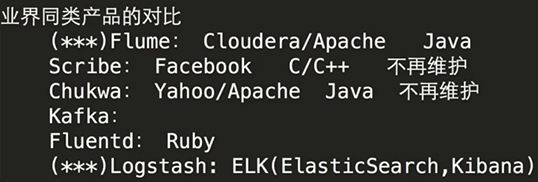
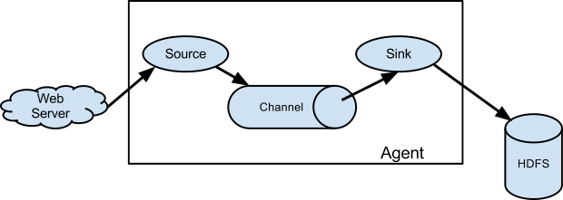
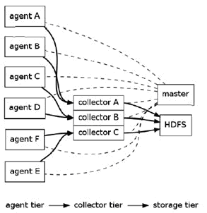
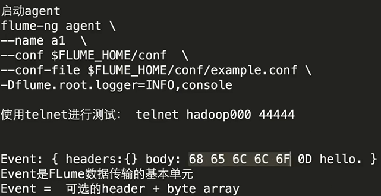
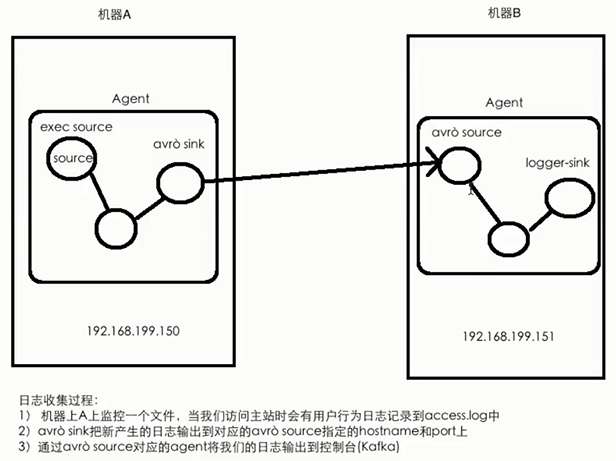

# Flume Note







---

## Installation (apache-flume-1.7.0-bin.tar.gz)

### Config Flume

1. Under `conf` directory, create flume-env.sh file based on flume-env.sh.template file. 
2. In flume-env.sh file, add JAVA_HOME class path: `export JAVA_HOME=/usr/lib/jvm/default-java`.

--- 

## Flume Configuration File (example.conf)

The key to use Flume is to **write configuration file**.

Steps:

 1. Configure source.
 2. Configure channel.
 3. Configure sink.
 4. Link the above three components up. Specify which channel will be connected to source and sink.

- a1: name of agent
- r1: name of source
- k1: name of sink
- c1: name of channel

---

**How to write configuration file:**

Copy the example config file from Flume website and then modify it.

---

Note:

- A source can map to multiple channels.
- A sink can only map one channel.

---



```
flume-ng agent \
--name a1 \
--conf $FLUME_HOME/conf \
--conf-file $FLUME_HOME/conf/example.conf \
-Dflume.root.logger=INFO,console
```

---



--- 

## netcat-memory-logger.conf

- source: netcat 
- channel: memory 
- sink: logger 

Listen to netcat and then display in console. 

How to use: 

1. In terminal A, start the agent. 
2. In terminal B, `telnet localhost 44444`.
3. In terminal B type something, then they will be displayed in terminal A.

--- 

## exec-memory-logger

- source: file 
- channel: memory 
- sink: logger 

Listen to a file (data.log) and then display to console.

> If you would like to listen to a file (check if there are an changes to this file), set source type as **exec**.

How to use: 

1. In terminal A, start the agent. 
2. In terminal B, add "hello" into data.log file. `echo hello >> data.log`. Then "hello" will be displayed in terminal A. 

--- 

## twoMachines/exec-memory-avro.conf & twoMachines/avro-memory-logger.conf

> 跨节点情况下，一般用avro 类型的sink 和 source。

machine A:

- source: file   
- channel: memory 
- sink: avro 

machine B:

- source: avro   
- channel: memory 
- sink: logger 


Listen to a file (data.log) on machine A. Then send to machine B. Then display on console.

How to use: 

1. In terminal 1, start machine B agent firstly. 

```
flume-ng agent \
--name avro-memory-logger \
--conf $FLUME_HOME/conf \
--conf-file $FLUME_HOME/conf/flumeTut/twoMachines/avro-memory-logger.conf \
-Dflume.root.logger=INFO,console
```

2. In terminal 2, start machine A agent secondly. 

```
flume-ng agent \
--name exec-memory-avro \
--conf $FLUME_HOME/conf \
--conf-file $FLUME_HOME/conf/flumeTut/twoMachines/exec-memory-avro.conf \
-Dflume.root.logger=INFO,console
```

3. In terminal 3,  add "hello" into data.log file. `echo hello >> data.log`. Then "hello" will be displayed in terminal 1. 


