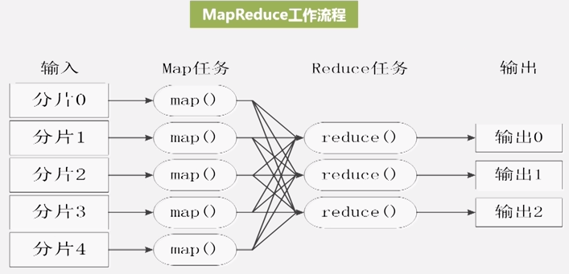

# Hadoop Note

## MapReduce

### MapReduce Architecture

---

### MapReduce Workflow

- Number of split（分片）= number of map() function.
- Practically, 1 block of the file on HDFS is 1 split.
- 1 reducer per computer core (best parallelism)

---

### Shuffle

- The intermediate result of shuffle, which is files, will be saved on local disk rather than HDFS.

---

### Word Count

Hadoop shuffles, groups, and distributes

reduce() aggregates

---

### Combiner

If the workload of the reducer is too large, it would be good to set combiners between the mapper and the reducer (before shuffle).  

#### Combine VS Merge

- Combine: <a, 1>  +  <a, 1>  ->  <a, 2>
- Merge: <a, 1>  +  <a, 2>  ->  <a, <1, 2>>

---

### MapReduce Application Patterns

- Filtering patterns
  - Sampling
  - Top-N
- Summarization patterns
  - Counting
  - Min/Max
  - Statistics
  - Index
- Structural patterns
  - Combining data sets

---

### MapReduce Coding

- When we use Hadoop MapReduce to run the jar file, Hadoop does not like to have the .class files in the same directory with the jar file.
- If you want to run MapReduce jar file, **NOTE** that Hadoop expects that the output directory is empty (and it will create it, if necessary).
