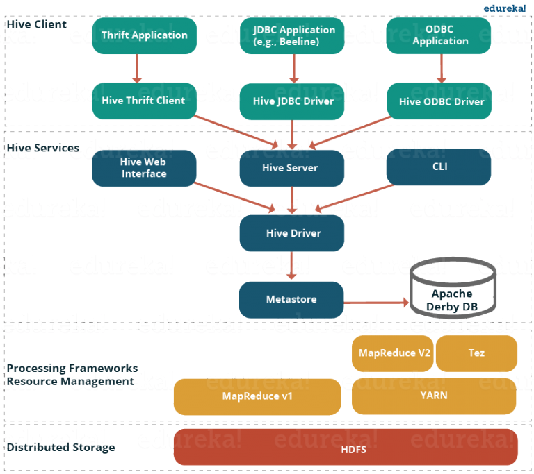
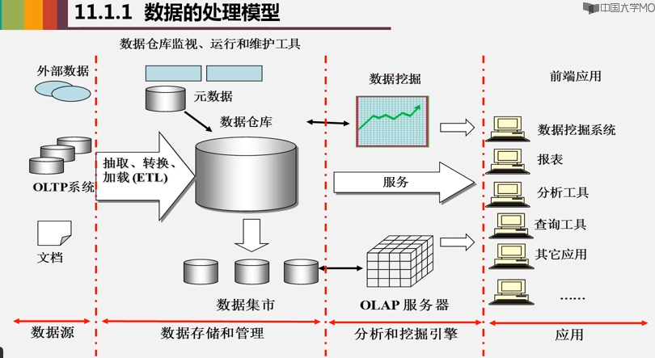

# Hive Note

## Basics

- Hive is a **data warehousing** component which performs reading, writing and managing large data sets in a distributed environment using SQL-like interface: HiveQL.
- Hive is mostly used for data warehousing where you can perform analytics and data mining that does not require real time processing.
- Hive internally gets converted into **MapReduce** programs.
- You can couple Hive with other tools to use it in many other domains. For example,
  - Tableau along with Apache Hive can be used for Data Visualization.
  - Apache Tez integration with Hive will provide you real time processing capabilities.
- Stores data in HDFS by default. Also supports Amazon S3.

### Limitations

- As Hadoop is intended for long sequential scans and Hive is based on Hadoop, you would expect queries to have a very high latency. (Response time: several minutes)
- Hive is **read-based** and therefore **not appropriate for transaction processing** that typically involves a high percentage of write operations.
- Not designed for OLTP. Only used for OLAP.
- Supports overwriting or apprehending data, but not updates and deletes.
- Sub queries are not supported in Hive.
- Index is less used in Hive, which is different with traditional DB.

### Managed Tables & External Tables

[Differences between managed tables & external tables:](http://www.aboutyun.com/thread-7458-1-1.html)

- When importing data to an external table, data is not moved under its data warehouse directory, which means data in the external table is not managed by Hive. This is different with managed table.
- Deleting:
  - When deleting managed tables, Hive will delete both metadata and data.
  - When deleting external tables, Hive only deletes metadata. Data is retained.

Which one to use?

- Not many differences in general. So, it depends on personal preference.
- Practical experience: If all processes involve Hive, create managed tables. Otherwise, use external tables.

---

## Architecture

---

## Coding

- `show databases;`
- `show tables;`
- `show create table <table_name>;`: Show statement that creates the table.
- `desc <table_name>;`: Show simple structure of the table.
- `desc formatted <table_name>;`: Show formatted detailed info about the table.
- `! <command>`: In Hive shell, execute Linux commands. For instance, `! ls`.
- Need alias when order by count. Otherwise, error "Not yet supported place for UDAF 'count'". For instance, `select count(*) as cnt, brand_id from user_log where action='2' group by brand_id order by cnt desc;`.
