# Spark Note

## Spark Core 

### Architecture  

A Job includes multiple RDDs. 

A RDD can be divided into multiple Stages. 

A Stage includes multiple Tasks. 

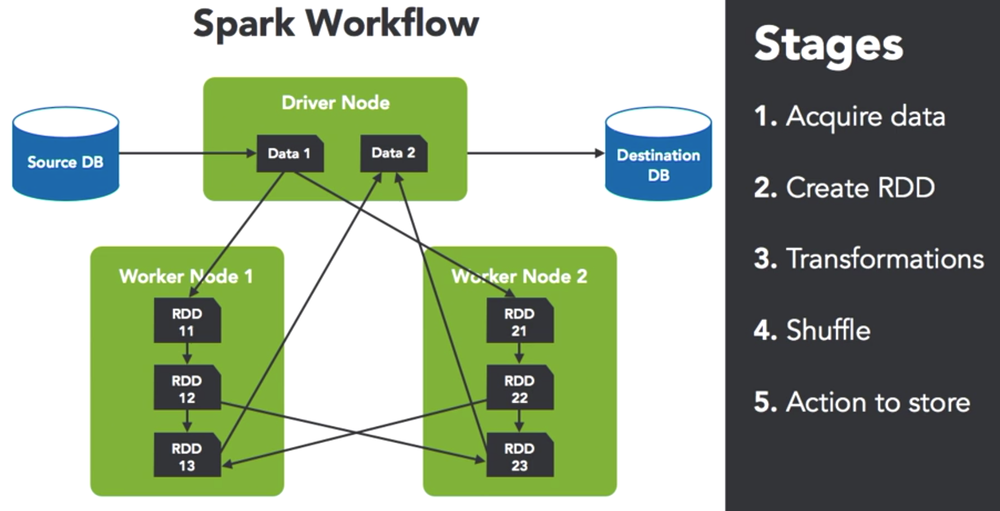

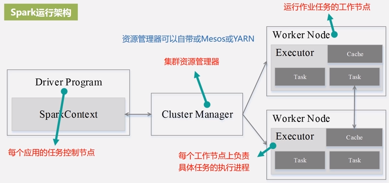

There is a **BlockManager** storage module in **Executor**, which uses both RAM and disk as storage devices in order to reduce IO overhead effectively.

When executing an application, Driver will apply resources from Cluster Manager, start up Executors, send program code and files to Executors, and then execute Tasks on Executors. 

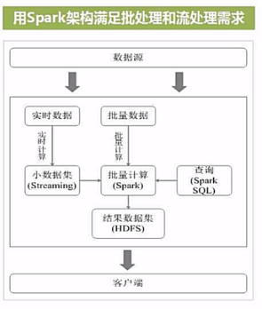

---

### Cluster Resource Manager 

- Standalone 
- Yarn 
- Mesos

Spark build-in cluster resource manager (standalone) is not easy to use. **DO NOT** use it generally. 

Mesos integrates with Spark better than Yarn. 

You can use Mesos and Yarn at the same time. Mesos is for **coarse-grained** management allocating resource to Docker, and then Yarn is for **fine-grained** management.

---

### RDD 

- A RDD (Resilient Distributed Dataset) is essentially a **read-only** partition record set. 

- Each RDD can be divided into multiple partitions. Each partition is a dataset fragment. Each partition can be stored on different nodes in the cluster. (parallel computing)

#### Partitioning 

##### Partitioning Rule 

- The number of partitions should be equal to the number or its integer multiple of CPU cores in the cluster as possible. 
- Each partition is generally between 100 - 200 MB.

##### Default Partition Number

Configure default partition number through set the parameter `spark.default.parallelism`. 

- Local model: Number of CPU of local machine. If `local[N]` has been set, default partition number is N. 
- Mesos: 8. 
- Standalone or Yarn: Max value between number of CPU cores in the cluster and 2. 

##### Manually Configure Partition 

RDD partitioning is automatic but can be done manually through programming. 

- When creating a RDD using `textFile()` or `parallelize()` methods, specify it. For example, `sc.textFile(<path>, <partitionNum>)`.
- When getting a new RDD by transformation, invoke `repartition(<partitionNum>)` method. For example, `rdd2 = rdd1.repartition(4)`. 4 partitions. 
  - Check number of partitions: `rdd2.partitions.size`.

##### Stage Division & Dependencies

- Narrow dependencies: The relationship between RDDs is 1 : 1 or many : 1.

- Wide dependencies: The relationship between RDDs is 1 : many or many : many.

Create a new stage when it comes across wide dependencies.

Optimize for dependencies:  

- Do as many narrow dependencies together before hitting a wide dependency.  
- Try to group wide dependency transformations together, possibly inside a single function and do it once.  

#### RDD Running Process 

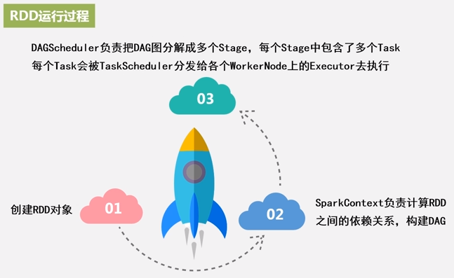

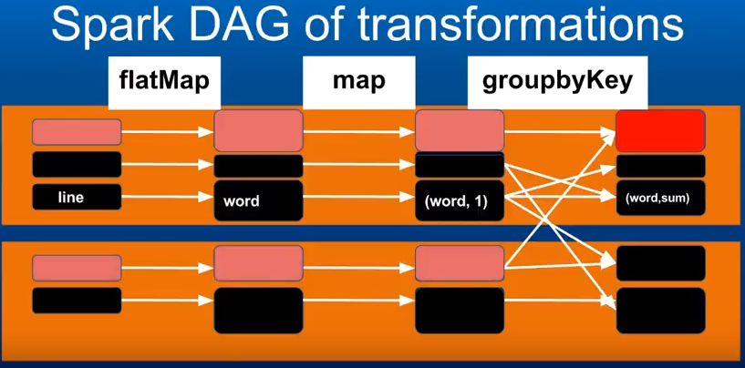

---

### Shared Variables 

#### Broadcast Variables 

- Use `SparkContext.broadcast(<var>)` to create a broadcast variable from a normal variable.

- The broadcast variable is like a wrapper of its corresponding normal variable. 

- All functions in the cluster can access the broadcast variable, thereby you do not need to repeatedly send the original normal variable to all nodes. 
- After creating the broadcast variable, the original normal variable cannot be modified. Consequently, the broadcast variable on all nodes are the same. 
- **When to use**: when a very large variable need to be used repeatedly.

For instance, 

1. Create: `val broadcastVar = sc.broadcast(Array(1,2,3))`

2. Get value: `broadcastVar.value`

#### Accumulators 

- Used for counter and sum functions. 
- Use `SparkContext.longAccumulator()` or `SparkContext.doubleAccumulator()` to create. 
- These accumulators are available on Slave nodes, but Slave nodes cannot read them. 
- Master node is the only one that can read and compute the aggregate of all updates.
- Spark support numeric accumulator by default. But you can customize other type. 

For instance, 

1. Create: `val nErrors=sc.accumulator(0.0)`

2. Load file: `val logs = sc.textFile("/Users/akuntamukkala/temp/output.
   log")`

3. Count number of "error": `logs.filter(_.contains(“error”)).foreach(x => nErrors += 1)`

4. Get value: `nErrors.value`

---

### Caching 

- By default, each job re-processes from HDFS. 
- `<rdd_var>.cache()` 
- Lazy 

When to cache data: 

- When doing data validation and cleaning. 
- Cache for iterative algorithm. 
- Generally, **DO NOT** use for input data as input data is too large. 

---

### Shuffle 

- Shuffle moves data across work nodes, which is costly. 

- Use minimal shuffle as possible and do them in late stages for better performance.  
- **DO NOT** use `groupByKey() + reduce()` if you can use `reduceByKey()`.
  - `groupByKey()` does not receive functions as parameter. When invoking it, Spark will move all key-value pairs, which will result in big overhead and transmission delay.

No shuffle transformations:  

- Map 
- Filter  
- FlatMap 
- MapPartitions  

Shuffle transformations:  

- Distinct  
- GroupByKey  
- ReduceByKey 
- Join  

---

### Lazy Evaluation 

Taking advantage of lazy evaluation:  

- Do as many transformations as possible before hitting an action.  
- Avoid debugging statements with shuffle, e.g. printing counts.  

---

### API 

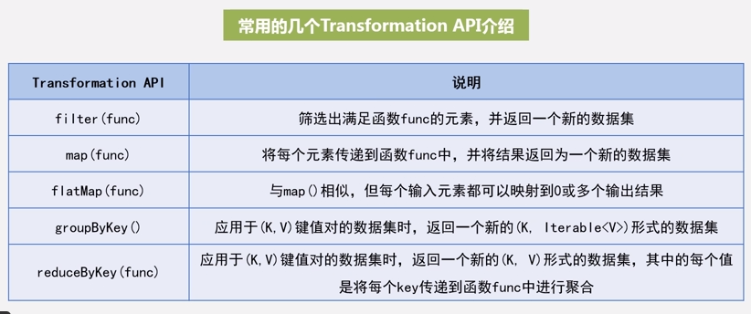

The difference between `foreach()` and `map()`: 

- `foreach()`: return void or no return value.
- `map()`: return dataset object. 

---

### Spark Core Coding 

- Get keys of RDD: `<rdd_var>.keys` 
- Get values of RDD: `<rdd_var>.values`
- Sort RDD by key: `<rdd_var>.sortByKey()`
  - Ascending is default. 
  - Descending: `<rdd_var>.sortByKey(false)`
- Sort RDD: `<rdd_var>.sortBy(<sort_accordance>)`
  - E.g. according to the second element of tuple in descending: `<rdd_var>.sortBy(_._2, false)`
- Only do mapping for RDD values: `<rdd_var>.mapValues(<func>)`
  - E.g. add 1 for values only: `<rdd_var>.mapValues(_ + 1)`
- Join two RDDs with the same key: `<rdd_var1>.join(<rdd_var2>)`
  - E.g. `(k, v1).join(k, v2)` Then you will get `(k, (v1, v2))`.
- Create a new key for RDD: `<rdd_var>.keyBy(<func>)`
  - E.g. `<rdd_var>.keyBy(<tuple> => <tuple._1>)`

---

## Spark SQL 

- Use RDD to process text file.

- Use Spark SQL to process database, e.g. MySQL. 

### DataFrame  

- A DataFrame is a kind of distributed dataset on basis of RDD. 

- A DataFrame is a distributed set of Row objects. Each Row object represents a row of record, which provide detailed schema info. 
- Through DataFrame, Spark SQL is able to know column name and type of the dataset. 

### SparkSession 

From Spark 2.0, `SparkSession` interface was introduced to realize all functions of `SQLContext` and `HiveContext`.

Using `SparkSession`, you can

- load data from different data source and transfer to DataFrame. 
- transfer DataFrame to table in `SQLContext`.
- use SQL statements to operate data. 

### RDD -> DataFrame 

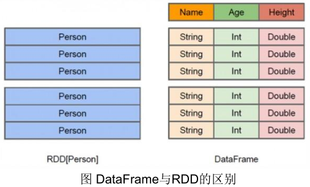

Two ways to transfer RDD to DataFrame: 

- Use Reflection to infer the schema of the RDD that contains specific type data. Firstly define a case class. Then Spark will transfer in to DataFrame implicitly. This way is suitable for the RDD whose data type is known.
- Use programming interface to construct a schema and apply it to the known RDD.  

### Spark SQL & Hive 

It is compulsory to add Hive support for Spark in order to accessing Hive using Spark. 

Pre-compile version Spark from official site generally does not contain Hive support. You need to compile the source code. 

---

## Spark Streaming 

Spark streaming is not real stream computing. It is second level. 

If you want millisecond level, use stream computing framework, e.g. Storm.  

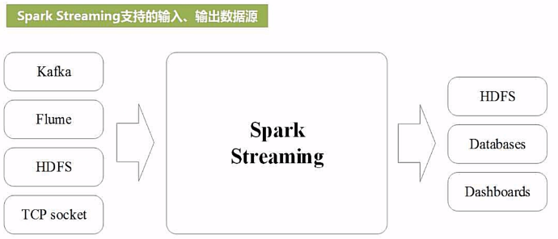

### Coding Steps 

---

## Spark ML

## Scaling 

### Scale Kafka Connect  

- Configure `tasks.max` to number of tables/files.  
- Create different instances for different tables/files.  
- Increase frequency of polling.  
- Use Kafka Connect in cluster mode.  

### Scale Kafka Broker  

- Create multiple partitions for each topic.  
- Increase nodes in the cluster.  

### Scale Spark Streaming  

- Have a single instance of the drive program with separate threads for each stream in the driver.  
- Create separate driver instances for each stream. 
- Spark cluster – add nodes.  

### Scale MySQL 

- Keep table size small, thereby keeping the entire table in memory, which makes updates and querying very quick. 
- Use distributed databases with a lot of nodes that are good for frequent updates – e.g. Cassandra.   

---

## Spark Ecosystem 

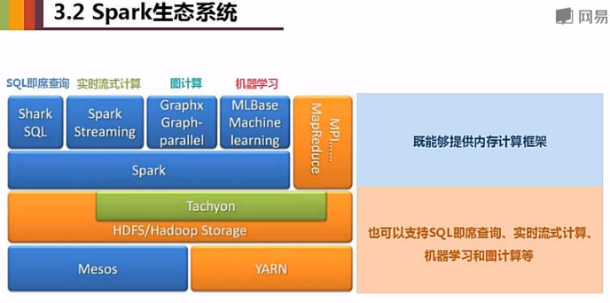

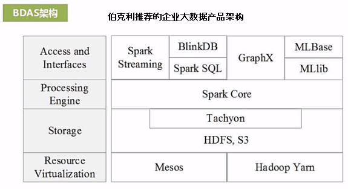

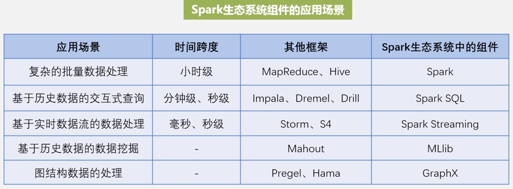

---

## Features & Versions 

- Write Ahead Logs (WAL): introduced in Spark Streaming 1.2.
- Direct approach of Spark Streaming and Kafka integration: introduced in Spark 1.3. 
- `SparkSession` interface: introduced in Spark 2.0. 
- After Spark 2.0, RDDs are replaced by Dataset, which is strongly-typed like an RDD.

---

## Glossary 

**Parquet**: It is a very efficient format. Generally, you take .csv or .json files. Then do ETL. Then write down to parquet files for future analysis. Parquet is great for **column oriented data**. The schema is in the file.  

**Avro**: Avro format is great for **row oriented data**. The schema is stored in another file. 
