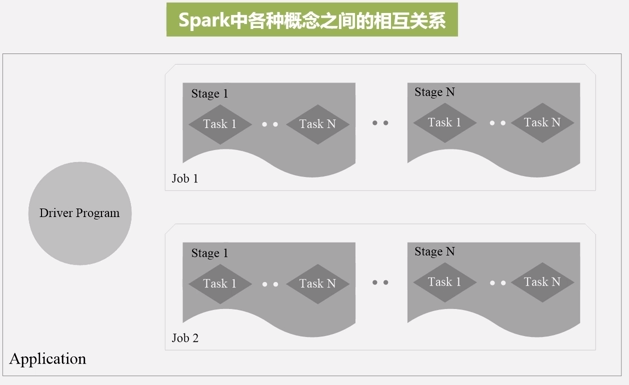

# Spark Note

## Architecture  

A Job includes multiple RDDs. 

A RDD can be divided into multiple Stages. 

A Stage includes multiple Tasks. 

There is a **BlockManager** storage module in **Executor**, which uses both RAM and disk as storage devices in order to reduce IO overhead effectively.

When executing an application, Driver will apply resources from Cluster Manager, start up Executors, send program code and files to Executors, and then execute Tasks on Executors. 

## Cluster Resource Manager 

- Standalone 
- Yarn 
- Mesos

Spark build-in cluster resource manager (standalone) is not easy to use. **DO NOT** use it generally. 

Mesos integrates with Spark better than Yarn. 

You can use Mesos and Yarn at the same time. Mesos is for **coarse-grained** management allocating resource to Docker, and then Yarn is for **fine-grained** management.

## Features & Versions 

- Write Ahead Logs (WAL) was introduced in Spark Streaming 1.2.

- Direct approach of Spark Streaming and Kafka integration was introduced in Spark 1.3. 

