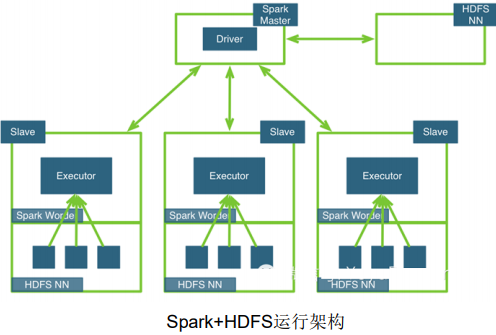
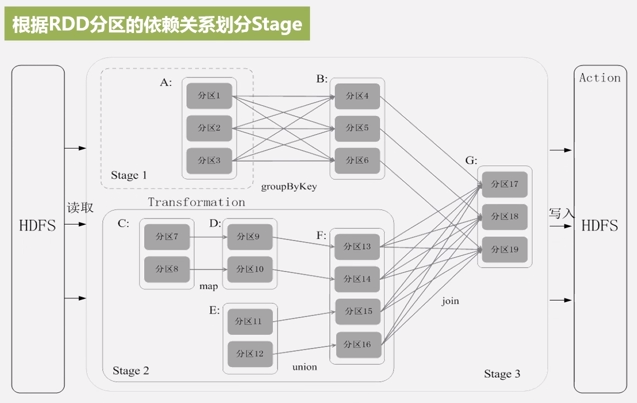
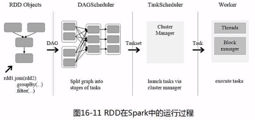
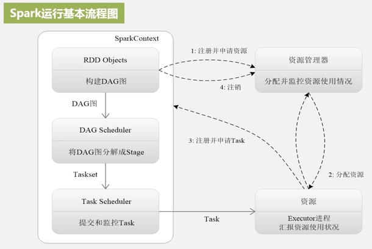
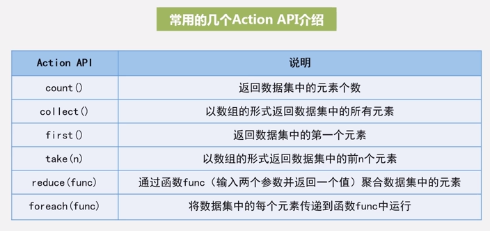

# Spark Note

## Spark Core 

### Architecture  

A Job includes multiple RDDs. 

A RDD can be divided into multiple Stages. 

A Stage includes multiple Tasks. 

There is a **BlockManager** storage module in **Executor**, which uses both RAM and disk as storage devices in order to reduce IO overhead effectively.

When executing an application, Driver will apply resources from Cluster Manager, start up Executors, send program code and files to Executors, and then execute Tasks on Executors. 

---

### Cluster Resource Manager 

- Standalone 
- Yarn 
- Mesos

Spark build-in cluster resource manager (standalone) is not easy to use. **DO NOT** use it generally. 

Mesos integrates with Spark better than Yarn. 

You can use Mesos and Yarn at the same time. Mesos is for **coarse-grained** management allocating resource to Docker, and then Yarn is for **fine-grained** management.

---

### RDD 

- A RDD (Resilient Distributed Dataset) is essentially a **read-only** partition record set. 

- Each RDD can be divided into multiple partitions. Each partition is a dataset fragment. Each partition can be stored on different nodes in the cluster. (parallel computing)

#### Partitioning 

##### Partitioning Rule 

- The number of partitions should be equal to the number or its integer multiple of CPU cores in the cluster as possible. 
- Each partition is generally between 100 - 200 MB.

##### Default Partition Number

Configure default partition number through set the parameter `spark.default.parallelism`. 

- Local model: Number of CPU of local machine. If `local[N]` has been set, default partition number is N. 
- Mesos: 8. 
- Standalone or Yarn: Max value between number of CPU cores in the cluster and 2. 

##### Manually Configure Partition 

RDD partitioning is automatic but can be done manually through programming. 

- When creating a RDD using `textFile()` or `parallelize()` methods, specify it. For example, `sc.textFile(<path>, <partitionNum>)`.
- When getting a new RDD by transformation, invoke `repartition(<partitionNum>)` method. For example, `rdd2 = rdd1.repartition(4)`. 4 partitions. 
  - Check number of partitions: `rdd2.partitions.size`.

##### Stage Division & Dependencies

- Narrow dependencies: The relationship between RDDs is 1 : 1 or many : 1.

- Wide dependencies: The relationship between RDDs is 1 : many or many : many.

Create a new stage when it comes across wide dependencies.

#### RDD Running Process 

---

### API 

The difference between `foreach()` and `map()`: 

- `foreach()`: return void or no return value.
- `map()`: return dataset object. 

---

### Shared Variables 

#### Broadcast Variables 

- Use `SparkContext.broadcast(<var>)` to create a broadcast variable from a normal variable.

- The broadcast variable is like a wrapper of its corresponding normal variable. 

- All functions in the cluster can access the broadcast variable, thereby you do not need to repeatedly send the original normal variable to all nodes. 
- After creating the broadcast variable, the original normal variable cannot be modified. Consequently, the broadcast variable on all nodes are the same. 
- **When to use**: when a very large variable need to be used repeatedly.

For instance, 

1. Create: `val broadcastVar = sc.broadcast(Array(1,2,3))`

2. Get value: `broadcastVar.value`

#### Accumulators 

- Used for counter and sum functions. 
- Use `SparkContext.longAccumulator()` or `SparkContext.doubleAccumulator()` to create. 
- These accumulators are available on Slave nodes, but Slave nodes cannot read them. 
- Master node is the only one that can read and compute the aggregate of all updates.
- Spark support numeric accumulator by default. But you can customize other type. 

For instance, 

1. Create: `val nErrors=sc.accumulator(0.0)`

2. Load file: `val logs = sc.textFile("/Users/akuntamukkala/temp/output.
   log")`

3. Count number of "error": `logs.filter(_.contains(“error”)).foreach(x => nErrors += 1)`

4. Get value: `nErrors.value`

---

### Caching 

- By default, each job re-processes from HDFS. 
- `<rdd_var>.cache()` 
- Lazy 

When to cache data: 

- When doing data validation and cleaning. 
- Cache for iterative algorithm. 
- Generally, **DO NOT** use for input data as input data is too large. 

---

### Shuffle 

---

### Spark Core Coding 

- Get keys of RDD: `<rdd_var>.keys` 
- Get values of RDD: `<rdd_var>.values`
- Sort RDD by key: `<rdd_var>.sortByKey()`
  - Ascending is default. 
  - Descending: `<rdd_var>.sortByKey(false)`
- Sort RDD: `<rdd_var>.sortBy(<sort_accordance>)`
  - E.g. according to the second element of tuple in descending: `<rdd_var>.sortBy(_._2, false)`
- Only do mapping for RDD values: `<rdd_var>.mapValues(<func>)`
  - E.g. add 1 for values only: `<rdd_var>.mapValues(_ + 1)`
- Join two RDDs with the same key: `<rdd_var1>.join(<rdd_var2>)`
  - E.g. `(k, v1).join(k, v2)` Then you will get `(k, (v1, v2))`.
- Create a new key for RDD: `<rdd_var>.keyBy(<func>)`
  - E.g. `<rdd_var>.keyBy(<tuple> => <tuple._1>)`

## Spark Streaming 

Spark streaming is not real stream computing. It is second level. 

If you want millisecond level, use stream computing framework, e.g. Storm.  

## Scaling 

### Scale Kafka Connect  

- Configure `tasks.max` to number of tables/files.  
- Create different instances for different tables/files.  
- Increase frequency of polling.  
- Use Kafka Connect in cluster mode.  

### Scale Kafka Broker  

- Create multiple partitions for each topic.  
- Increase nodes in the cluster.  

### Scale Spark Streaming  

- Have a single instance of the drive program with separate threads for each stream in the driver.  
- Create separate driver instances for each stream. 
- Spark cluster – add nodes.  

### Scale MySQL 

- Keep table size small, thereby keeping the entire table in memory, which makes updates and querying very quick. 
- Use distributed databases with a lot of nodes that are good for frequent updates – e.g. Cassandra.   

---

## Features & Versions 

- Write Ahead Logs (WAL) was introduced in Spark Streaming 1.2.

- Direct approach of Spark Streaming and Kafka integration was introduced in Spark 1.3. 

