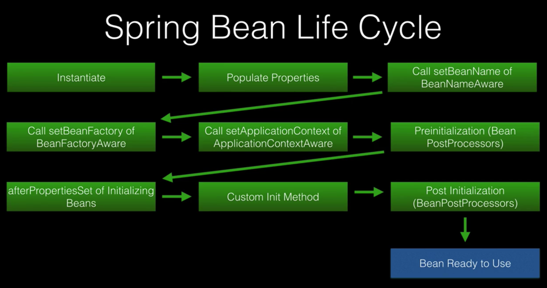
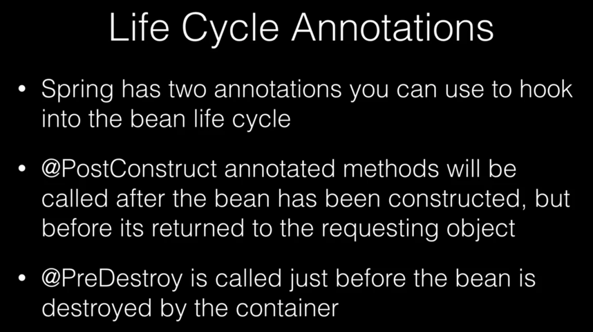
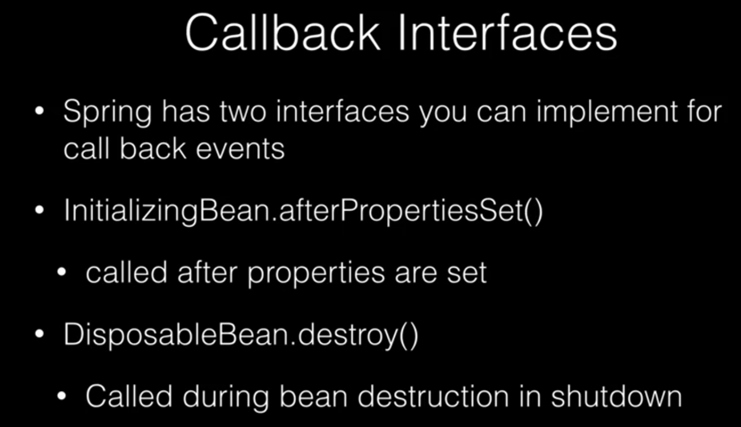

# Spring Note

## Basic Concepts

### Dependency Injection (DI)

Three ways:

- By constructor - most preferred
  - If a bean only has one constructor, you can omit the `@Autowired` on the top the constructor.
  - Mark the private property as `final` indicating that it cannot be subsequently changed.
- By setters - area of much debate, may have NullPointerException
- By class properties - least preferred

DI via interfaces rather than concrete classes is highly preferred.

- Allows runtime to decide implementation to inject.
- Follows Interface Segregation Principle of SOLID.
- Makes your code more testable.

---

### Inversion of Control (IoC)

- Allows dependencies to be injected at runtime.
- Dependencies are not predetermined.

---

### Spring Bean Life Cycle







---

## Spring MVC 


---

## Spring Boot

### Run Applications

Three ways to run a Spring Boot application:

- Run in IDE.
- In terminal, `cd` into project folder. Use Maven to run.`mvn spring-boot:run`.
- In terminal, `cd` into project folder. Use Maven to compile.`mvn install`. Then cd into "target" folder. Use java to execute the .jar file. `java -jar <project_name>.jar`.

---

### application.properties File

Common properties

```properties
server.port=8080
server.servlet.context-path=/<project_name>

spring.datasource.url:jdbc:mysql://127.0.0.1:3306/<table_name>?useSSL=false
spring.datasource.username:<database_username>
spring.datasource.password:<database_password>
spring.datasource.driver:com.mysql.jdbc.Driver

# the way you would like the database to be initialized
spring.jpa.hibernate.ddl-auto=update

# whether or not show sql in console for testing
spring.jpa.hibernate.show-sql=true

spring.jpa.properties.hibernate.dialect:org.hibernate.dialect.MySQL5Dialect
```

How to access properties in properties file? - Use ${ }

```properties
property_name=property_value
property_name2=${property_name}
```

How to access properties in code? - Use annotation.

```java
@Value("${property_name}")
private String property_name;
```
**In real projects, there should be three properties files.**

- application-dev.properties: configure properties for development environment.
- application-prod.properties: configure properties for production environment.
- application.properties: determine which properties file will be used. And common configure properties for both dev and prod environment.
  - For development environment: `spring.profiles.active=dev`.
  - For production environment: `spring.profiles.active=prod`.

When you run the project in terminal, you can specify which one you will use. `java -jar <project_name>.jar --spring.profiles.active=prod`.

---

##  Practical Skills

When testing using **Postman**, if you are testing `PUT` method, you need to select "**x-www-form-urlencoded**" for RequestParam in Body instead of "**form-data**".