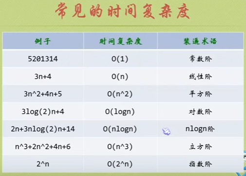
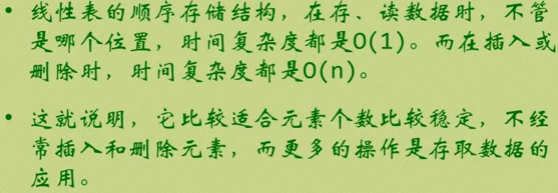
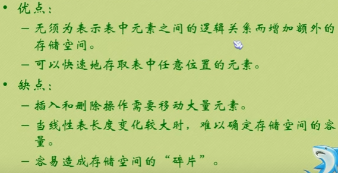
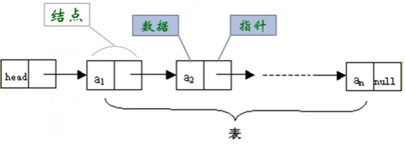

# 数据结构与算法
(https://www.youtube.com/playlist?list=PLuRm_QtoJ4J-Ld1BPZ7F2VLfNgfgjpj17)

---

## 1.数据结构和算法绪论

程序设计 = 数据结构 + 算法

数据结构就是数据元素相互之间存在的一种或多种特定关系的集合。

数据结构：

- 逻辑结构
- 物理结构

四大逻辑结构：

- 集合结构：数据元素同属于一个集合。
- 线性结构：数据元素之间是一对一的关系。
- 树形结构：数据元素之间存在一对多的层次关系。
- 图形结构：数据元素之间是多对多的关系。

物理（存储）结构：

- 顺序存储： e.g.数组。对于时常要变化的结构，顺序存储不科学。
- 链式存储：更灵活。分两个域 - 数据域，指针域。

---

## 2.谈谈算法

算法初体验： e.g.求1+2+3+···+100。

算法的五个基本特性：

- 输入：算法有零个或多个输入。
- 输出：算法至少有一个或多个输出。打印或返回值。
- 有穷性
- 确定性
- 可行性

算法设计的要求：

- 正确性
	- 四个层次：
		- 算法程序没有语法错误。
		- 算法程序对于合法的输入能产生满足要求的输出。
		- 算法程序对于非法的输入能产生满足规格的说明。
		- 算法程序对于故意刁难的测试输入都有满足要求的输出结果。
- 可读性
- 健壮性
- 时间效率高、存储量低

---

## 3.时间复杂度和空间复杂度

算法效率的度量：（抛开硬件和软件因素）

- 算法的好坏
- 问题的输入规模

函数的渐进增长：

- 常数项、与最高次项相乘的常数、其他次要项都不重要，可忽略。
- 只需关注最高项的阶数。

### 算法的时间复杂度

**判断一个算法的好坏，只通过少量数据不能做出准确判断，容易以偏概全。**

最坏运行时间是一种保证。通常提到的运行时间都是指最坏情况的运行时间。

### 算法的空间复杂度

写代码时的一个技巧，可以用空间开销换取时间开销。但具体情况具体分析。

提及“复杂度”，通常指时间复杂度。

对时间复杂度的追求更符合算法的潮流。

---

## 4.线性表(List)

线性表可为空，即空表。

线性表中从1开始，不从0。

**抽象数据类型**（Abstract Data Type，ADT）：

- 一个数学模型及定义在该模型上的一组操作。e.g.类。
- 把数据类型和相关操作捆绑在一起。e.g.面向对象高级语言把属性和方法捆绑在一起。

**内存上的数据只能被覆盖。**

**线性表的两种物理存储结构:**

- 顺序存储结构：用一段地址连续的存储单元依次存储线性表的数据元素。
	- 特点：随机存储结构
	- 
	- 
	- **若线性表需要频繁查找，很少进行插入和删除操作时，或事先知道表长，宜采用顺序存储结构。** e.g.用户注册账户，只有注册时需要插入，绝大多数情况都是读取。

- 链式存储结构：用一组任意的存储单元存储线性表的数据元素，这组存储单元可以在内存中未被占用的任意位置，数据分散在内存的各个角落。
	- 既要存储数据元素信息 + 还要存储后继元素的存储地址（指针或链）
	- 结点(Node) = 数据域 + 指针域 

### 链式存储结构

- 单链表：每个Node中只包含一个指针域。
	-  
	- 头指针是链表的必要元素，不能为空。否则链表不存在。
	- 单链表读取的核心思想：工作指针后移。
	- **对于插入或删除数据频繁的操作，或表中元素个数不知道或变化较大时，宜用单链表** e.g.游戏中玩家的装备列表，随着游戏进度，可能会随时增加或删除。
	- 单链表的整表建立方法：
		- 头插法
		- 尾插法
	- **学线性表实际上就是学单链表。因为它比较关键。**

- 静态链表：用数组描述的链表。游标实现法。
	- 目的：给没有指针的编程语言设计的一种实现单链表功能的方法。

- 循环链表
	- 不要头指针，新增尾指针rear。
	- if (rear == rear -> next)，则为空链表。
	- 时间复杂度为O(1)。
	- 有环：链表的尾节点指向链表中的某个节点。